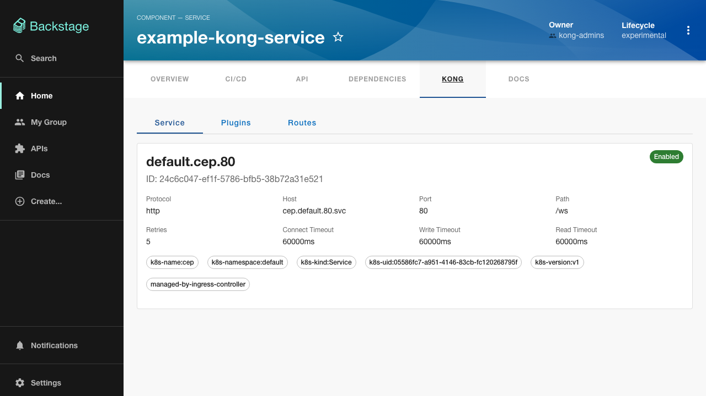
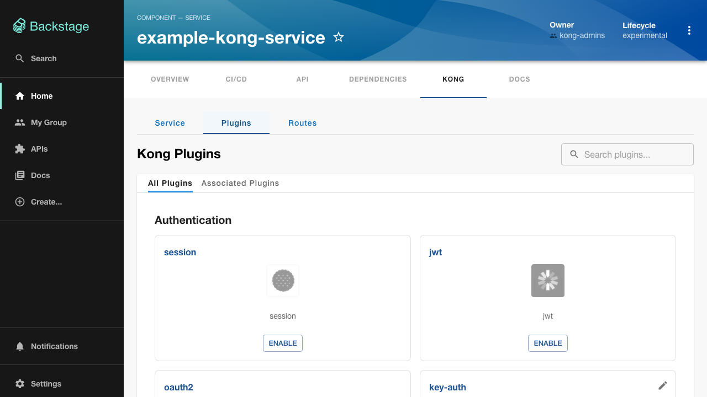
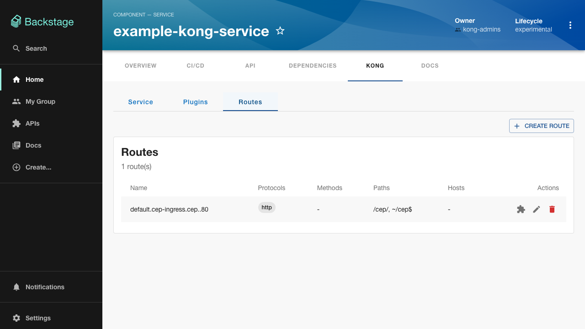

# Kong Service Manager

<!-- markdownlint-disable MD033 -->

Backstage frontend plugin for managing
[Kong Gateway](https://konghq.com/products/kong-gateway) services, routes,
and plugins directly from the catalog.

## Features

- View Kong service details (protocol, host, port, timeouts, tags)
- List and manage plugins on a service (add, edit, remove)
- List and manage routes on a service (create, edit, delete)
- Manage plugins scoped to individual routes
- Move a route plugin into Git: **promote to code** (from a live experiment) or
  **edit in code** (for a plugin already owned by the chart) — each opens a merge
  request against the service's chart instead of writing to the gateway. See
  [Applying changes to Kong](../../docs/applying-changes-to-kong.md).
- Promotion state shown per route plugin (experimental, code-owned, promotion
  open, applying, codified, failed) with the merge-request link
- Dynamic plugin configuration based on Kong schema introspection
- Multi-instance support with an instance selector dropdown
- Plugin categorization (AI, Authentication, Security, Traffic Control, etc.)
- Bilingual UI (English default, Brazilian Portuguese) via Backstage i18n

## Screenshots

<div class="screenshot-carousel">
  
  
  
</div>

<style>
.screenshot-carousel {
  display: flex;
  overflow-x: auto;
  gap: 1rem;
  padding: 1rem 0;
}
.screenshot-carousel img {
  flex: 0 0 auto;
  max-width: 420px;
  height: auto;
  border-radius: 8px;
  box-shadow: 0 2px 8px rgba(0,0,0,0.1);
}
</style>

## Installation

This plugin ships as an OCI artifact through `devportal-plugin-export-overlays`.
DevPortal installs it from `quay.io/veecode`; see the [root README](../../../../README.md)
for the distribution flow. The backend plugin is also required; see the
[backend plugin README](../kong-service-manager-backend/README.md).

## Setup

Add the plugin to your Entity page in `packages/app/src/components/catalog/EntityPage.tsx`:

```tsx
import { KongServiceManagerContent } from '@veecode-platform/backstage-plugin-kong-service-manager';
import { isKongServiceManagerAvailable } from '@veecode-platform/backstage-plugin-kong-service-manager-common';

// Inside your EntityLayout:
<EntityLayout.Route
  if={isKongServiceManagerAvailable}
  path="/kong-service-manager"
  title="Kong"
>
  <KongServiceManagerContent />
</EntityLayout.Route>
```

The `isKongServiceManagerAvailable` guard ensures the tab only appears on
entities that have the required annotation.

## Annotate Your Entities

Add the `kong-manager/service-name` annotation to any catalog entity that
maps to a Kong service:

```yaml
apiVersion: backstage.io/v1alpha1
kind: Component
metadata:
  name: my-service
  annotations:
    kong-manager/service-name: my-kong-service
spec:
  type: service
  owner: team-a
```

If you use multiple Kong instances, specify which one(s) the entity should
use:

```yaml
metadata:
  annotations:
    kong-manager/service-name: my-kong-service
    kong-manager/instance: production
```

When `kong-manager/instance` is omitted, all configured instances are
available via the instance selector dropdown.

## UI Overview

The plugin renders a tabbed interface on the entity page:

- **Service** - Displays service info (protocol, host, port, path, timeouts,
  tags) and the list of associated plugins.
- **Plugins** - Browse and manage service-level plugins. Add new plugins from
  the list of available Kong plugins, or edit/remove existing ones.
- **Routes** - View, create, edit, and delete routes. Each route shows its
  protocols, methods, paths, hosts, and configuration flags. Open **Manage
  plugins** on a route to attach plugins scoped to that single route.

A service plugin (Plugins tab) takes effect in the gateway immediately. A route
plugin (Manage plugins) does too, but can additionally be **moved into Git**: its
card shows a promotion badge and, depending on ownership, a **Promote to code** or
**Edit in code** action that opens a merge request against the service's chart.
Plugins the chart already owns are read-only in the gateway and edited only in
code. See [Applying changes to Kong](../../docs/applying-changes-to-kong.md) for
when each path applies.

## Exports

| Export | Type | Description |
|---|---|---|
| `kongServiceManagerPlugin` | Plugin | Backstage plugin instance. |
| `KongServiceManagerContent` | Component | Routable extension to mount on entity pages. |
| `kongServiceManagerApiRef` | ApiRef | API reference for dependency injection. |
| `KongServiceManagerClient` | Class | Default API client implementation. |
| `useEntityAnnotations` | Hook | Reads Kong annotations from the current entity. |
| `kongServiceManagerTranslations` | TranslationResource | Translation resource for the plugin (English default, `pt-BR` bundled). |

## Dynamic Plugin Wiring

This plugin ships as an OCI artifact through `devportal-plugin-export-overlays`.
DevPortal installs it from `quay.io/veecode`; see the [root README](../../../../README.md)
for the distribution flow. Its UI elements are configured without source changes:

```yaml
plugins:
  # Tag from the overlay metadata: bs_<backstage>__<version>
  - package: oci://quay.io/veecode/veecode-platform-backstage-plugin-kong-service-manager:bs_<backstage>__<version>!veecode-platform-backstage-plugin-kong-service-manager
    disabled: false
    pluginConfig:
      dynamicPlugins:
        frontend:
          veecode-platform.backstage-plugin-kong-service-manager:
            entityTabs:
              - path: /kong
                title: Kong
                mountPoint: entity.page.kong
            mountPoints:
              - mountPoint: entity.page.kong/cards
                importName: KongServiceManagerContent
                config:
                  layout:
                    gridColumn: "1 / -1"
```

**VeeCode DevPortal** already bundles the dynamic plugin as a pre-installed plugin with default configs, so it can be alternatively be loaded just using a local path:

```yaml
plugins:
  - package: ./dynamic-plugins/dist/backstage-plugin-kong-service-manager-dynamic
    disabled: false
  - package: ./dynamic-plugins/dist/backstage-plugin-kong-service-manager-backend-dynamic
    disabled: false
```
